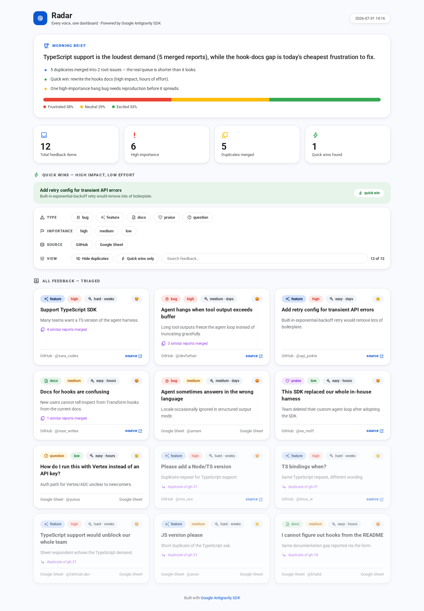

# Radar 📡

Every voice, one dashboard.

Radar collects feedback from **GitHub Issues**, **Google Sheets**, and **Gmail**, triages it
with a **Google Antigravity SDK** agent, and renders a live, filterable HTML dashboard.



- 📌 Short auto-generated title for every item (invented when the rant has none)
- 🏷️ Category: bug / feature / question / docs / praise / rant
- 🔴 Importance + 🛠️ estimated difficulty + ⏱️ ETA
- 😡 Sentiment (frustrated / neutral / excited)
- ⧉ Automatic duplicate merging (5 reports of the same thing → 1 card)
- ⚡ Quick Wins: high impact + low effort, flagged automatically
- ☕ Executive morning brief + overall mood bar
- 🎛️ Fully filterable: type, importance, source, duplicates, quick wins, live search
- 🔁 Automatic retries with exponential backoff (SDK v0.1.9 `RetryConfig`)
- 🛟 Tool failures recover gracefully (SDK v0.1.9 `ToolExecutionError` hooks)
- ⏰ `--serve` mode rebuilds the dashboard daily via the SDK trigger system

## Try it in 30 seconds (no API key)

```bash
python radar.py --demo
```

Open `dashboard.html` — same pipeline, precomputed data.

## Real run

```bash
pip install google-antigravity
export GEMINI_API_KEY="your_key"   # from aistudio.google.com
python radar.py
```

### Keep it fresh: scheduled rebuilds ⏰

```bash
python radar.py --serve
```

Runs once immediately, then rebuilds every `SIGNAL_SERVE_INTERVAL` seconds
(default: 86400 = daily) using the SDK's official `every()` trigger mechanism.

### Sources (environment variables)

| Variable | Description | Default |
|---|---|---|
| `SIGNAL_GITHUB_REPO` | Public repo `owner/repo` (no token needed) | `google-antigravity/antigravity-sdk-python` |
| `SIGNAL_SHEET_CSV` | Published Google Sheet CSV URL | local `sample_feedback.csv` |
| `SIGNAL_GMAIL_QUERY` | Gmail search query | `label:feedback newer_than:30d` |
| `SIGNAL_MODEL` | Override the model | SDK default |
| `SIGNAL_SERVE_INTERVAL` | Seconds between rebuilds in `--serve` mode | `86400` |

### Google Sheets as a source
1. Open the sheet (e.g. Google Form responses)
2. **File → Share → Publish to web → CSV**
3. Set `SIGNAL_SHEET_CSV` to that link

Expected columns: `feedback, author, date` (lenient — falls back to the first column).

### Gmail as a source (optional)
```bash
pip install google-api-python-client google-auth-oauthlib
```
1. Enable the **Gmail API** in Google Cloud Console
2. Create OAuth credentials (Desktop app), save `credentials.json` next to the script
3. First run opens a consent screen and saves `token.json` (chmod 600)

If setup is missing, the source skips itself silently.

## Security notes 🔒
- Feedback text is treated as **untrusted data** — the agent is instructed to ignore any
  instructions embedded inside it (prompt-injection guard)
- Agent runs with the SDK default **read-only** policy — it never touches your filesystem
- All feedback content is HTML-escaped before rendering (XSS-safe)
- `credentials.json` and `token.json` are git-ignored — never commit them

## Tests

```bash
pip install pytest
pytest test_radar.py -v
```

## Roadmap
- GitHub MCP server instead of REST (deeper pulls)
- Cron-expression triggers (SDK currently ships `every()` only)
- More sources: Discord, Play Store reviews, X

---

Built with [Google Antigravity SDK](https://github.com/google-antigravity/antigravity-sdk-python) v0.1.9 🤖
